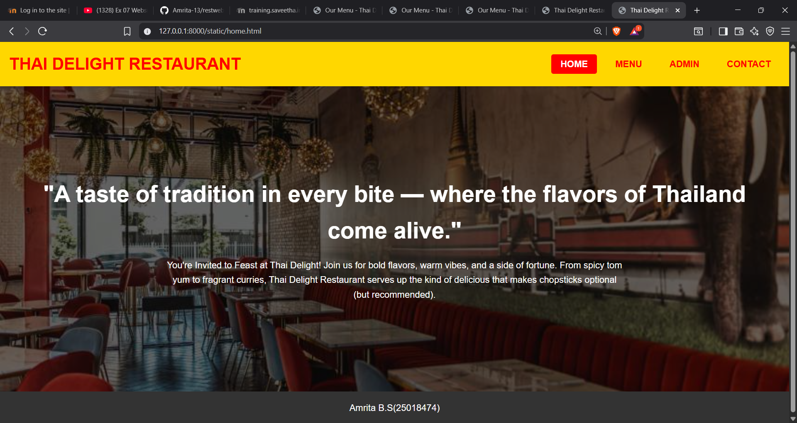
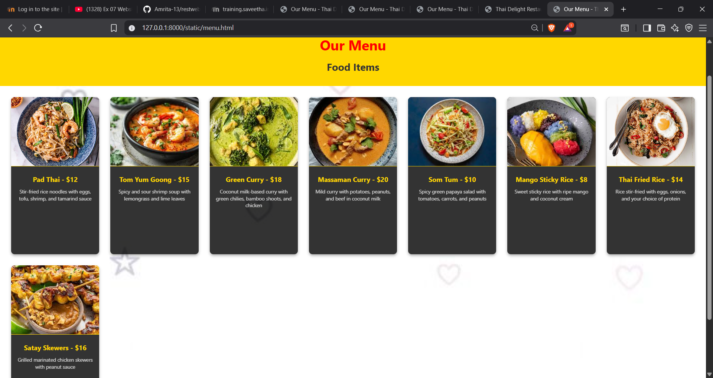
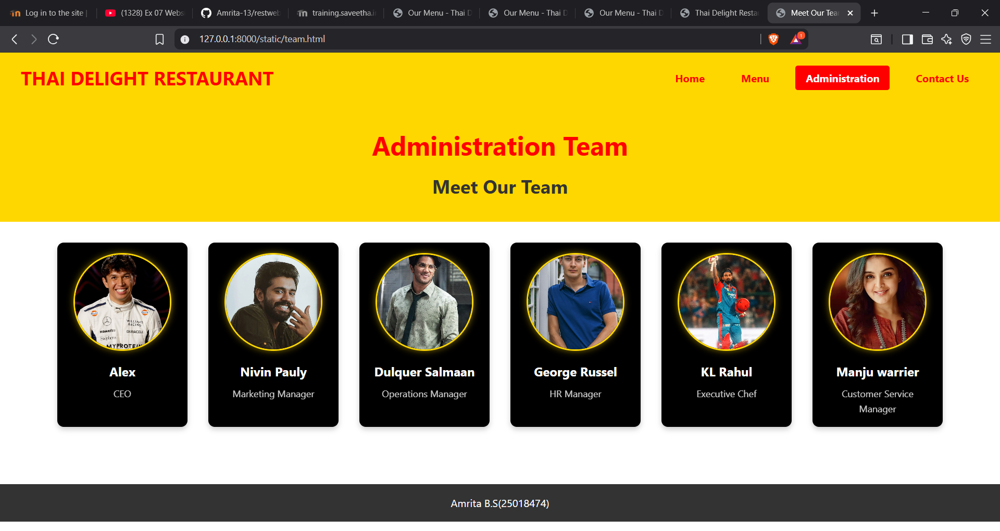
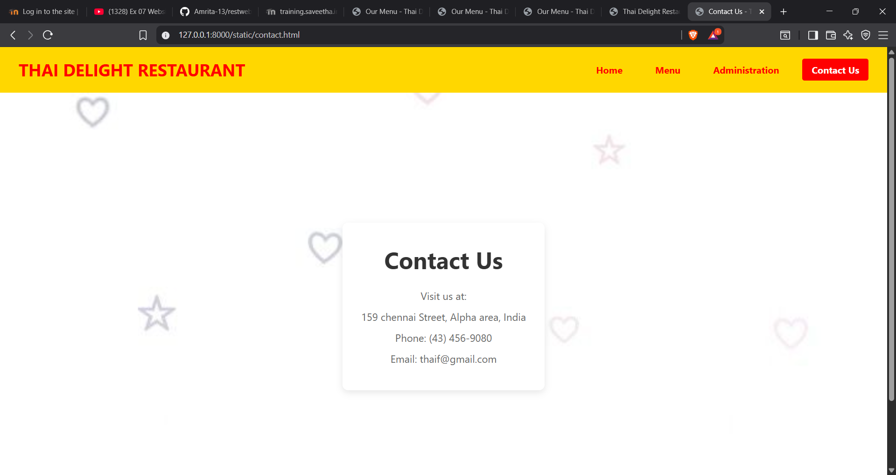

# Ex.07 Restaurant Website
## Date:8.10.2025

## AIM:
To develop a static Restaurant website to display the food items and services provided by them.

## DESIGN STEPS:

### Step 1:
Requirement collection.

### Step 2:
Creating the layout using HTML and CSS.

### Step 3:
Updating the sample content.

### Step 4:
Choose the appropriate style and color scheme.

### Step 5:
Validate the layout in various browsers.

### Step 6:
Validate the HTML code.

### Step 7:
Publish the website in the given URL.

## PROGRAM:
```
home.html:
<head>
    <meta charset="UTF-8">
    <meta name="viewport" content="width=device-width, initial-scale=1.0">
    <title>Thai Delight Restaurant</title>
    <link rel="stylesheet" href="style.css">
    <link rel="stylesheet" href="home.css"> 
</head>
<body>
    <header>
        <div class="logo">THAI DELIGHT RESTAURANT</div>
        <nav>
            <ul>
                <li><a href="home.html" class="active">HOME</a></li>
                <li><a href="menu.html">MENU</a></li>
                <li><a href="team.html">ADMIN</a></li>
                <li><a href="contact.html">CONTACT</a></li>
            </ul>
        </nav>
    </header>

    <main>
        <section class="hero-section">
            <div class="hero-content">
                <h1>"A taste of tradition in every bite — where the flavors of Thailand come alive."</h1>
                <p>You're Invited to Feast at Thai Delight! Join us for bold flavors, warm vibes, and a side of fortune. From spicy tom yum to fragrant curries, Thai Delight Restaurant serves up the kind of delicious that makes chopsticks optional (but recommended).</p>
            </div>
        </section>
    </main>

    <footer>
        <p> Amrita B.S(25018474)</p>
    </footer>
</body>
</html>

home.css:
body {
    margin: 0;
    font-family: Arial, sans-serif;
    background: url('thai.jpg') no-repeat center center;
    background-size: cover;
    color: white;
}

header {
    background: #FFD700;
    padding: 1rem;
    display: flex;
    justify-content: space-between;
    align-items: center;
}

nav ul {
    display: flex;
    list-style: none;
    margin: 0;
    padding: 0;
}

nav ul li {
    margin-left: 1rem;
}

nav ul li a {
    text-decoration: none;
    color: #FF0000;
    font-weight: bold;
}

.hero-section {
    padding: 4rem 2rem;
    text-align: center;
    background: rgba(0, 0, 0, 0.6);
    min-height: 80vh;
    display: flex;
    align-items: center;
    justify-content: center;
}

.hero-content h1 {
    font-size: 2.5rem;
    margin-bottom: 1rem;
}

.hero-content p {
    font-size: 1rem;
    max-width: 800px;
    margin: 0 auto;
}

footer {
    background: #333;
    color: white;
    text-align: center;
    padding: 1rem;
}

style.css:
* {
    margin: 0;
    padding: 0;
    box-sizing: border-box;
}

body {
    font-family: 'Segoe UI', Tahoma, Geneva, Verdana, sans-serif;
    line-height: 1.6;
    color: #333;
}

header {
    background-color: #FFD700;
    padding: 1rem 2rem;
    display: flex;
    justify-content: space-between;
    align-items: center;
    box-shadow: 0 2px 5px rgba(0,0,0,0.1);
}

.logo {
    font-size: 1.8rem;
    font-weight: bold;
    color: #FF0000;
    text-transform: uppercase;
}

nav ul {
    display: flex;
    list-style: none;
}

nav ul li {
    margin-left: 1.5rem;
}

nav ul li a {
    text-decoration: none;
    color: #FF0000;
    font-weight: bold;
    padding: 0.5rem 1rem;
    border-radius: 4px;
    transition: all 0.3s ease;
}

nav ul li a:hover,
nav ul li a.active {
    background-color: #FF0000;
    color: #FFFFFF;
}

main {
    min-height: calc(100vh - 150px);
}

footer {
    background-color: #333;
    color: white;
    text-align: center;
    padding: 1rem;
    position: relative;
    bottom: 0;
    width: 100%;
}    
    .logo {
        margin-bottom: 1rem;
        font-size: 1.5rem;
    }
    
    nav ul {
        flex-wrap: wrap;
        justify-content: center;
    }
    
    nav ul li {
        margin: 0.5rem;
    }
}
menu.html
<head>
    <meta charset="UTF-8">
    <meta name="viewport" content="width=device-width, initial-scale=1.0">
    <title>Our Menu - Thai Delight Restaurant</title>
    <link rel="stylesheet" href="style.css">
    <link rel="stylesheet" href="menu.css"> 
</head>
<body>
    <header>
        <div class="logo">THAI DELIGHT RESTAURANT</div>
        <nav>
            <ul>
                <li><a href="home.html">Home</a></li>
                <li><a href="menu.html" class="active">Menu</a></li>
                <li><a href="team.html">Administration</a></li>
                <li><a href="contact.html">Contact Us</a></li>
            </ul>
        </nav>
    </header>

    <main>
        <section class="menu-header">
            <h1>Our Menu</h1>
            <h2>Food Items</h2>
        </section>

        <section class="menu-grid">
            <div class="menu-item">
                
                <div class="item-info">
                    <h3>Pad Thai - $12</h3>
                    <p>Stir-fried rice noodles with eggs, tofu, shrimp, and tamarind sauce</p>
                </div>
            </div>

            <div class="menu-item">
                
                <div class="item-info">
                    <h3>Tom Yum Goong - $15</h3>
                    <p>Spicy and sour shrimp soup with lemongrass and lime leaves</p>
                </div>
            </div>

            <div class="menu-item">
                
                <div class="item-info">
                    <h3>Green Curry - $18</h3>
                    <p>Coconut milk-based curry with green chilies, bamboo shoots, and chicken</p>
                </div>
            </div>

            <div class="menu-item">
                
                <div class="item-info">
                    <h3>Massaman Curry - $20</h3>
                    <p>Mild curry with potatoes, peanuts, and beef in coconut milk</p>
                </div>
            </div>

            <div class="menu-item">
                
                <div class="item-info">
                    <h3>Som Tum - $10</h3>
                    <p>Spicy green papaya salad with tomatoes, carrots, and peanuts</p>
                </div>
            </div>

            <div class="menu-item">
                
                <div class="item-info">
                    <h3>Mango Sticky Rice - $8</h3>
                    <p>Sweet sticky rice with ripe mango and coconut cream</p>
                </div>
            </div>

            <div class="menu-item">
                
                <div class="item-info">
                    <h3>Thai Fried Rice - $14</h3>
                    <p>Rice stir-fried with eggs, onions, and your choice of protein</p>
                </div>
            </div>

            <div class="menu-item">
                
                <div class="item-info">
                    <h3>Satay Skewers - $16</h3>
                    <p>Grilled marinated chicken skewers with peanut sauce</p>
                </div>
            </div>
        </section>
    </main>

    <footer>
        <p> Amrita B.S (25018474)</p>
    </footer>
</body>
</html>

team.html
<html lang="en">
<head>
    <meta charset="UTF-8">
    <meta name="viewport" content="width=device-width, initial-scale=1.0">
    <title>Meet Our Team - Thai Delight Restaurant</title>
    <link rel="stylesheet" href="style.css">
    <link rel="stylesheet" href="team.css">
</head>
<body>
    <header>
        <div class="logo">THAI DELIGHT RESTAURANT</div>
        <nav>
            <ul>
                <li><a href="home.html">Home</a></li>
                <li><a href="menu.html">Menu</a></li>
                <li><a href="team.html" class="active">Administration</a></li>
                <li><a href="contact.html">Contact Us</a></li>
            </ul>
        </nav>
    </header>

    <main>
        <section class="team-header">
            <h1>Administration Team</h1>
            <h2>Meet Our Team</h2>
        </section>

        <section class="team-members">
            <div class="team-member">
                <div class="profile-circle">
                    
                </div>
                <div class="member-info">
                    <h3>Alex</h3>
                    <p>CEO</p>
                </div>
            </div>

            <div class="team-member">
                <div class="profile-circle">
                    
                </div>
                <div class="member-info">
                    <h3>Nivin Pauly</h3>
                    <p>Marketing Manager</p>
                </div>
            </div>

            <div class="team-member">
                <div class="profile-circle">
                    
                </div>
                <div class="member-info">
                    <h3>Dulquer Salmaan</h3>
                    <p>Operations Manager</p>
                </div>
            </div>

            <div class="team-member">
                <div class="profile-circle">
                    
                </div>
                <div class="member-info">
                    <h3>George Russel</h3>
                    <p>HR Manager</p>
                </div>
            </div>

            <div class="team-member">
                <div class="profile-circle">
                    
                </div>
                <div class="member-info">
                    <h3>KL Rahul</h3>
                    <p>Executive Chef</p>
                </div>
            </div>

            <div class="team-member">
                <div class="profile-circle">
                    
                </div>
                <div class="member-info">
                    <h3>Manju warrier</h3>
                    <p>Customer Service Manager</p>
                </div>
            </div>
        </section>
    </main>

    <footer>
        <p>Amrita B.S(25018474)</p>
    </footer>
</body>
</html>
team.css:
.team-header {
    background-color: #FFD700;
    padding: 2rem;
    text-align: center;
}

.team-header h1 {
    color: #FF0000;
    font-size: 2.5rem;
    margin-bottom: 0.5rem;
}

.team-header h2 {
    color: #333;
    font-size: 1.8rem;
}

.team-members {
    display: flex;
    flex-wrap: wrap;
    justify-content: center;
    gap: 2rem;
    padding: 2rem;
}

.team-member {
    background-color: #000;
    color: white;
    border-radius: 10px;
    overflow: hidden;
    width: 200px;
    box-shadow: 0 4px 8px rgba(0,0,0,0.2);
    transition: transform 0.3s ease;
}

.team-member:hover {
    transform: translateY(-5px);
}

.profile-circle {
    width: 150px;
    height: 150px;
    border-radius: 50%;
    overflow: hidden;
    margin: 1rem auto;
    border: 3px solid #FFD700;
    box-shadow: 0 0 10px rgba(255,215,0,0.5);
}

.profile-circle img {
    width: 100%;
    height: 100%;
    object-fit: cover;
}

.member-info {
    text-align: center;
    padding: 0 1rem 1rem;
}

.member-info h3 {
    font-size: 1.2rem;
    margin-bottom: 0.5rem;
}

.member-info p {
    font-size: 0.9rem;
    opacity: 0.8;
}
contact.html:
<html lang="en">
<head>
    <meta charset="UTF-8">
    <meta name="viewport" content="width=device-width, initial-scale=1.0">
    <title>Contact Us - Thai Delight Restaurant</title>
    <link rel="stylesheet" href="style.css">
    <link rel="stylesheet" href="contact.css">
</head>
<body>
    <header>
        <div class="logo">THAI DELIGHT RESTAURANT</div>
        <nav>
            <ul>
                <li><a href="home.html">Home</a></li>
                <li><a href="menu.html">Menu</a></li>
                <li><a href="team.html">Administration</a></li>
                <li><a href="contact.html" class="active">Contact Us</a></li>
            </ul>
        </nav>
    </header>

    <main>
        <section class="contact-background">
            <div class="contact-container">
                <h1>Contact Us</h1>
                <div class="contact-info">
                    <p>Visit us at:</p>
                    <p>159  chennai Street, Alpha area, India</p>
                    <p>Phone: (43) 456-9080</p>
                    <p>Email: thaif@gmail.com</p>
                </div>
            </div>
        </section>
    </main>

    <footer>
        <p>Amrita B.S(25018474)</p>
    </footer>
</body>
</html>
contact.css
.contact-background {
    background: url('bc.jpg') no-repeat center center;
    background-size: cover;
    height: 100vh;
    display: flex;
    align-items: center;
    justify-content: center;
    padding: 2rem;
}

.contact-container {
    background-color: rgba(255, 255, 255, 0.85);
    padding: 2rem;
    border-radius: 10px;
    box-shadow: 0 4px 12px rgba(0,0,0,0.1);
    max-width: 500px;
    text-align: center;
}

.contact-container h1 {
    color: #333;
    font-size: 2.5rem;
    margin-bottom: 1rem;
}

.contact-info {
    font-size: 1.1rem;
    line-height: 1.6;
    color: #666;
}

.contact-info p {
    margin: 0.5rem 0;
}

```

## OUTPUT:




## RESULT:
The program for designing software company website using HTML and CSS is completed successfully.
